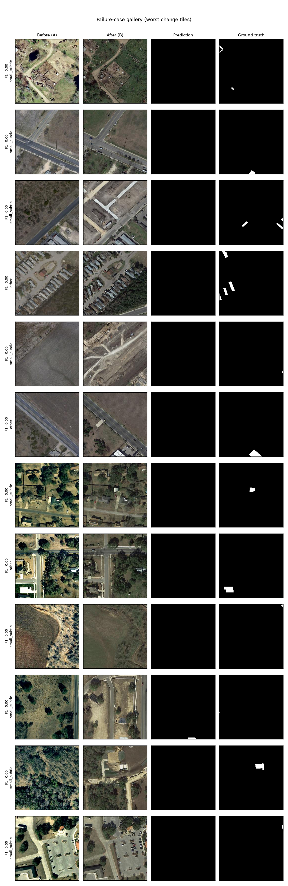

# Satellite Change Detection

Given two images of the same place at two times, produce a map of **what changed** — and
serve it through an interactive web demo. This is a portfolio project: the **evaluation
harness and reproducibility are first-class deliverables**, not afterthoughts.

> **Status:** M2 complete — a **Siamese-SegFormer** (ImageNet-pretrained MiT-b2) reaches LEVIR-CD
> test **F1 0.911 / IoU 0.836** (baseline 0.886), evaluated through a full harness with PR-curve
> threshold selection, per-scene breakdown, an auto-generated failure gallery, and a fusion
> ablation. See [Results](#results--levir-cd-track-a) and [milestones](#milestones).
> Next: M3 (DINOv2 foundation-model tier + 3-way comparison).

## Two imagery tracks (they must not be mixed)

- **Track A — high-res aerial (0.5 m RGB):** LEVIR-CD (binary building change) + xBD (disaster
  damage, multi-class). Powers the curated demo.
- **Track B — Sentinel-2 (10 m multispectral):** OSCD. Powers the **live AOI** demo, which pulls
  fresh Sentinel-2 scenes at inference.

## Results — LEVIR-CD (Track A)

Three models on the **identical LEVIR-CD test split** through the **identical harness**. The
operating threshold is chosen on the validation split (max-F1) and then applied to test — never
tuned on test. Metrics are for the **change class only**; overall pixel accuracy is ~99% for a
trivial "predict no change" model and is deliberately not reported.

| Model | Trainable params | Threshold | Precision | Recall | F1 | IoU |
|---|---|---|---|---|---|---|
| FC-Siam-diff (baseline) | 0.83M | 0.168 | 0.899 | 0.874 | **0.886** | 0.796 |
| Siamese-SegFormer / MiT-b2 (diff) | 24.72M | 0.480 | 0.917 | 0.905 | **0.911** | 0.836 |
| Siamese-SegFormer / MiT-b2 (concat) | 24.98M | 0.527 | 0.912 | 0.901 | **0.907** | 0.829 |

The ImageNet-pretrained MiT-b2 encoder lifts test F1 from 0.886 → **0.911** (average precision
0.943), in line with published LEVIR-CD SegFormer-class results.

**Fusion ablation (difference vs concatenation)** — same encoder, schedule, LR, epochs and seed;
only the fusion changes. Difference fusion wins by ~0.4 F1 / 0.7 IoU, consistent with the
FC-Siam-diff intuition that the change signal lives in the *difference* of the two dates' features:

| Fusion | F1 | IoU | Precision | Recall |
|---|---|---|---|---|
| difference \|a−b\| | **0.9106** | 0.8358 | 0.917 | 0.905 |
| concatenation [a,b] | 0.9066 | 0.8292 | 0.912 | 0.901 |

**Per-scene variance (honest caveat)** — metrics per test scene (n=128), mean±std:

| Model | per-scene F1 | min | max |
|---|---|---|---|
| baseline | 0.734 ± 0.314 | 0.00 | 0.97 |
| SegFormer (diff) | 0.761 ± 0.315 | 0.00 | 0.98 |
| SegFormer (concat) | 0.764 ± 0.306 | 0.00 | 0.98 |

The strong model lifts the per-scene **mean** (0.734 → 0.761) but does **not tighten the spread**
(std ≈ 0.31, min 0.00 for all three). The gain is a roughly uniform lift, not a fix for the hardest
scenes. The aggregate F1 gain (0.886 → 0.911) exceeds the per-scene-mean gain because the aggregate
is pixel-weighted — dominated by large-change scenes — while the per-scene mean weights every scene
equally, including the many test scenes with only a tiny change where the model still struggles.

**Failure gallery (auto-generated).** The 12 worst change tiles are all **small/subtle changes the
model misses entirely** (blank prediction), which the harness tags by cause bucket:




Reproduce with `python -m src.evaluate --config configs/levircd_segformer.yaml --split test`
and `python -m src.compare --manifest configs/compare_levircd.yaml`.

**Why the split matters (domain gap):** a model trained on 0.5 m aerial imagery does **not**
transfer to 10 m Sentinel-2 — resolution and spectral characteristics differ by more than an
order of magnitude. Running the LEVIR-CD model on live Sentinel-2 would produce meaningless
output. The live mode therefore uses a Sentinel-2-native model trained on OSCD. This is a
documented design decision, not a footnote.

## Architecture

```
 LEONARDO HPC (trains)                          HUGGING FACE (serves)
 login: stage data + FM weights (egress)        FastAPI + onnxruntime (CPU) :7860
   -> $SCRATCH/$WORK data                          |- /curated : Track-A ONNX, before/after
   -> SLURM (Singularity, GPU) -> checkpoints      |- /live-aoi: STAC -> Sentinel-2 ->
   -> evaluate.py -> results/ (metrics, PR,        |             Track-B ONNX -> overlay
      failure gallery)                           React + MapLibre (swipe slider, AOI draw)
   -> export.py -> artifact bundle  --push-->  HF Model repo --pull--> Space
```

The **artifact bundle** is the contract between the two surfaces: per model, a directory with
`model.onnx`, `config.yaml`, `preprocessing.json`, and `metrics_card.md`. The demo consumes
only the bundle — never the training code.

## Repository layout

```
configs/     one yaml per model + a smoke config each
src/         data/ · models/ · train.py · evaluate.py · export.py  (config-driven)
scripts/     stage_data.sh · stage_weights.sh   (login-node downloads + checksums)
slurm/       train.sbatch   (templated for Leonardo)
container/   changedet.def  (Singularity/Apptainer)
experiments/ LOG.md         (job id · config · git sha · outcome)
results/     metrics tables, PR curves, failure images (large binaries gitignored)
app/         HF Space: Dockerfile · backend (FastAPI) · frontend (React+MapLibre)
```

## Development

Local dev needs only the light tooling (heavy ML/geo deps run on Leonardo / the HF Space):

```bash
python -m venv .venv && source .venv/bin/activate
pip install -e ".[dev]"      # ruff, mypy, pytest
ruff check . && ruff format --check . && mypy && pytest -q
```

CI (GitHub Actions, Python 3.11) runs exactly this on every push.

## Training on Leonardo (HPC)

Cluster-specific settings (allocation, partition, container image, torch build) are resolved
from `leonardo.md` and kept in local project notes (not committed). Data and pretrained weights
are pre-staged on the login node (compute nodes have **no internet egress**); training reads
only local storage. Always run a **smoke config** before any full submission.

## Milestones

| | Milestone | State |
|---|---|---|
| M0 | Setup: skeleton, CI, data staging, container draft | ✅ done |
| M1 | Baseline (FC-Siam-diff) end-to-end on HPC | ✅ done — LEVIR-CD test **F1 0.884** / IoU 0.793 |
| M2 | Strong model (Siamese-SegFormer) + full eval harness | ✅ done — LEVIR-CD test **F1 0.911** / IoU 0.836 |
| M3 | Foundation-model tier (DINOv2) + 3-model comparison | todo |
| M4 | ONNX export + curated HF Space | todo |
| M5 | Live Sentinel-2 AOI mode | todo |
| M6 | Disaster xBD multi-class track | todo |
| M7 | Polish: README, model cards, demo GIF | todo |

## License & data hygiene

Code: [MIT](LICENSE). **Trained weights** inherit the research/non-commercial terms of their
datasets (LEVIR-CD, xBD, OSCD) → showcase/demo use only. Datasets are **never committed** — see
`scripts/` for download scripts only.
