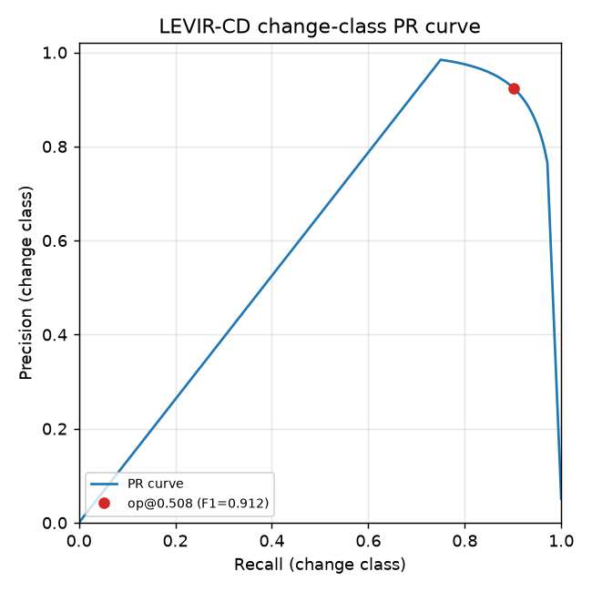
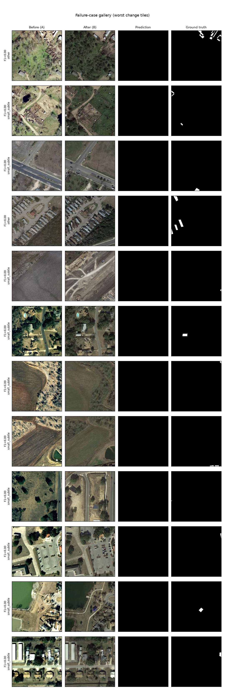

# Satellite Change Detection

Given two images of the same place at two times, produce a map of **what changed** — and
serve it through an interactive web demo. This is a portfolio project: the **evaluation
harness and reproducibility are first-class deliverables**, not afterthoughts.

> **Status: delivered (M0–M5 complete).** 🛰️ **Live demo:**
> **<https://geospatiaproject-geospatial1.hf.space>** — a single Hugging Face Docker Space serving
> two curated tracks with CPU `onnxruntime`.
>
> The **Aerial** track's headline is a **DINOv2-base + LoRA** foundation-model tier reaching LEVIR-CD
> test **F1 0.913 / IoU 0.839** with only **2.82M trainable params**, matching (to slightly beating)
> the 24.7M-param Siamese-SegFormer (F1 0.911) — the defensible claim is **parameter efficiency**
> (~9× fewer trainable params), not a decisive accuracy win. Full four-tier comparison through one
> harness — PR-curve threshold selection, per-scene breakdown, auto-generated failure gallery, and
> fusion + adaptation ablations. The **Sentinel-2** track adds a genuinely 10 m-native OSCD model over
> five real-world change sites, framed honestly as directionally-correct-not-fine-grained. See
> [Aerial results](#results--levir-cd-track-a), [Sentinel-2 results](#results--sentinel-2-track-b),
> and [milestones](#milestones). The disaster **xBD** track (M6) was scoped but is **out of scope /
> not built**.

## Two imagery tracks (they must not be mixed)

- **Track A — high-res aerial (0.5 m RGB):** LEVIR-CD (binary building change). Powers the **Aerial**
  curated tab — the high-accuracy showcase. *(xBD disaster damage was planned for M6 — out of scope.)*
- **Track B — Sentinel-2 (10 m multispectral):** OSCD. Powers the **Sentinel-2** curated tab — a
  Sentinel-2-native model over five real-world change sites, predictions **precomputed at build time**
  from Planetary Computer scenes and served from cache (no runtime inference, STAC, or GPU).

A model trained on 0.5 m aerial imagery does **not** transfer to 10 m Sentinel-2, so the two tracks
use separate models; see the [domain-gap note](#why-the-split-matters) below.

## Results — LEVIR-CD (Track A)

Four model tiers on the **identical LEVIR-CD test split** through the **identical harness**. The
operating threshold is chosen on the validation split (max-F1) and then applied to test — never
tuned on test. Metrics are for the **change class only**; overall pixel accuracy is ~99% for a
trivial "predict no change" model and is deliberately not reported.

| Model | Trainable params | Threshold | Precision | Recall | F1 | IoU | AP |
|---|---|---|---|---|---|---|---|
| FC-Siam-diff (baseline) | 0.83M | 0.168 | 0.899 | 0.874 | **0.886** | 0.796 | 0.932 |
| Siamese-SegFormer / MiT-b2 (diff) | 24.72M | 0.480 | 0.917 | 0.905 | **0.911** | 0.836 | 0.943 |
| Siamese-SegFormer / MiT-b2 (concat) | 24.98M | 0.527 | 0.912 | 0.901 | **0.907** | 0.829 | 0.939 |
| DINOv2-base frozen linear-probe | 1.64M | 0.469 | 0.900 | 0.878 | **0.889** | 0.800 | 0.924 |
| **DINOv2-base + LoRA** (FM tier) | **2.82M** | 0.508 | 0.924 | 0.901 | **0.913** | 0.839 | 0.946 |

Both pretrained encoders clear the from-scratch baseline (0.886) and land together at the top — the
ImageNet MiT-b2 (0.911) and the self-supervised **DINOv2-base + LoRA (0.913)**, a statistical tie on
accuracy (within noise). What separates them is **trainable cost** — 2.82M vs 24.72M — the
[foundation-model question](#foundation-model-tier--does-pretraining-beat-an-imagenet-backbone-and-at-what-cost)
below.

**Fusion ablation (difference vs concatenation)** — same encoder, schedule, LR, epochs and seed;
only the fusion changes. Difference fusion wins by ~0.4 F1 / 0.7 IoU, consistent with the
FC-Siam-diff intuition that the change signal lives in the *difference* of the two dates' features:

| Fusion | F1 | IoU | Precision | Recall |
|---|---|---|---|---|
| difference \|a−b\| | **0.9106** | 0.8358 | 0.917 | 0.905 |
| concatenation [a,b] | 0.9066 | 0.8292 | 0.912 | 0.901 |

### Foundation-model tier — does pretraining beat an ImageNet backbone, and at what cost?

The DINOv2 tier uses a **frozen**, self-supervised ViT-B/14 (`facebook/dinov2-base`) as a
weight-shared Siamese encoder feeding a multi-layer change decoder, adapted two ways. This is a
clean single-variable ablation — identical image size, schedule, LR, epochs and seed; only the
adaptation changes:

| Adaptation | Trainable params | F1 | IoU | AP |
|---|---|---|---|---|
| frozen linear-probe (decoder only) | 1.64M | 0.889 | 0.800 | 0.924 |
| + LoRA (r=16 on attention q/k/v/proj) | **2.82M** | **0.913** | **0.839** | **0.946** |

Two things fall out:

- **Frozen DINOv2 features already match a purpose-built CD baseline.** With *no* encoder training —
  just a decoder over frozen features — the probe reaches **0.889 F1**, edging the FC-Siam-diff
  baseline (0.886). The self-supervised representation already encodes most of what change detection
  needs; only 1.64M decoder params are trained.
- **LoRA supplies the decisive adaptation.** Adding **1.18M** LoRA params lifts F1 by **+0.024**
  (0.889 → 0.913), IoU **+0.039**, and AP **+0.022** — enough to reach parity with the 24.72M-param
  SegFormer. The lift comes from *both* strong pretrained features *and* lightweight task adaptation,
  not either alone.

**Bottom line — parity plus efficiency.** DINOv2 + LoRA matches, to slightly beats, the specialist
SegFormer on accuracy (F1 0.913 vs 0.911 — **within noise**; IoU 0.839 vs 0.836; AP 0.946 vs 0.943)
while training **~9× fewer parameters** (2.82M vs 24.72M). The robust, defensible claim is the
**parameter efficiency**, not the fractional F1 lead: foundation-model pretraining reaches
specialist-level accuracy at a fraction of the trainable cost. Like SegFormer and unlike the baseline
(0.168), the FM is well-calibrated — its optimal threshold (0.508) sits at ~0.5.



**Per-scene variance (honest caveat)** — metrics per test scene (n=128), mean±std:

| Model | per-scene F1 | min | max |
|---|---|---|---|
| baseline | 0.734 ± 0.314 | 0.00 | 0.97 |
| SegFormer (diff) | 0.761 ± 0.315 | 0.00 | 0.98 |
| DINOv2 frozen-probe | 0.743 ± 0.307 | 0.00 | 0.96 |
| DINOv2 + LoRA | 0.767 ± 0.312 | 0.00 | 0.98 |

DINOv2 + LoRA posts the **highest per-scene mean (0.767)** — but the spread is unchanged (std ≈ 0.31,
min 0.00 for every tier). Better pretraining lifts the mean; it does **not** tighten the variance or
rescue the hardest scenes. As in M2, the aggregate F1 (pixel-weighted, dominated by large-change
scenes) gains more than the per-scene mean (which weights every scene equally, including the many
tiny-change scenes where all models still struggle).

**Failure gallery (auto-generated).** Across *every* tier the worst change tiles are the same:
**small/subtle changes missed entirely** (blank prediction). For DINOv2 + LoRA, 10 of the 12 worst
tiles are tagged `small_subtle` by the harness (11/12 for the frozen probe); the SegFormer shows the
identical pattern. Foundation-model pretraining does **not** solve this failure mode.



Reproduce the full comparison with `python -m src.compare --manifest configs/compare_levircd.yaml`
(per-model artifacts via `python -m src.evaluate --config configs/levircd_dinov2.yaml --split test`).

### Why the split matters

A model trained on 0.5 m aerial imagery does **not** transfer to 10 m Sentinel-2 — resolution and
spectral characteristics differ by more than an order of magnitude. Running the LEVIR-CD model on
Sentinel-2 would produce meaningless output. The Sentinel-2 tab therefore uses a **Sentinel-2-native
model trained on OSCD**. This is a documented design decision, not a footnote.

## Results — Sentinel-2 (Track B)

The **Sentinel-2** tab is powered by a compact 4-band (**RGB + NIR** = S2 B04/B03/B02/B08) Siamese
model trained on **OSCD** (Onera Satellite Change Detection — 24 Sentinel-2 pairs). OSCD is tiny and
genuinely hard, so scores are **modest by design** and framed that way in the UI and the model card.

| Model | Trainable params | F1 | IoU | Precision | Recall |
|---|---|---|---|---|---|
| **FC-Siam-diff, 4-band (from scratch)** — demo model | 0.83M | **0.453** | 0.293 | 0.492 | 0.420 |
| Siamese-SegFormer MiT-b0, 4-band (ImageNet-pretrained) | — | 0.413 | — | — | — |

Threshold selected on val (max-F1) → applied to test (0.469); per-scene F1 **0.378 ± 0.175** (n=10);
overall pixel accuracy deliberately not reported. **ImageNet pretraining transfers poorly to 10 m
multispectral** — the from-scratch baseline wins, so it is the deployed demo model. This is the
opposite of the Track-A story (where pretraining helped), and that contrast is itself a finding.

**Honest framing (kept prominent in the app):** Sentinel-2 is a coarse 10 m domain and this model is
**directionally correct on large real-world change, not a fine-grained detector**. The high-resolution
aerial LEVIR-CD track is the high-accuracy showcase; the Sentinel-2 track exists to run on any
real-world location, plainly caveated.

### Live demo — curated Sentinel-2

Five real-world sites with large, obvious change visible even at 10 m. For each, a low-cloud
before/after Sentinel-2 L2A pair is fetched from **Planetary Computer at build time**, co-registered
(each pair shares one MGRS tile → identical UTM grid), run through the OSCD ONNX model **offline**, and
baked (before/after/overlay PNGs + stats) into a cache the Space serves instantly — **no runtime
inference, STAC, or GPU**.

| Site | Tile | Before → After | Detected change |
|---|---|---|---|
| Dubai — Deira Islands reclamation | T40RCP | 2016-03-20 → 2023-04-28 | 13.2% |
| Grand Ethiopian Renaissance Dam — reservoir filling | T36PYT | 2020-02-14 → 2023-12-25 | 8.3% |
| Beijing Daxing International Airport | T50SMJ | 2016-10-10 → 2020-10-04 | 34.6% |
| Bhadla Solar Park, Rajasthan | T42RYR | 2017-12-17 → 2021-12-16 | 4.3% |
| New Administrative Capital, Egypt | T36RUU | 2016-08-27 → 2023-08-26 | 20.4% |

Before/after acquisitions are matched by **relative orbit and season** where it matters (e.g. Beijing's
after-scene is same-orbit, same-early-October as the before) to suppress crop-phenology change and
isolate the real built change.

**Reproduce (Track B):** stage OSCD on the Leonardo login node (`scripts/stage_data.sh oscd`), train
single-GPU (`python -m src.train --config configs/oscd_s2.yaml`), export the 4-band bundle
(`python -m src.export --config configs/oscd_s2.yaml --checkpoint <best.pt> --out-dir bundles`), then
bake the AOIs offline (`python app/backend/build_sentinel2.py`, which needs the build-time STAC deps
`pystac-client` / `planetary-computer` / `rasterio`).

## Architecture

```
 LEONARDO HPC (trains)                    BUILD-TIME (local)              HUGGING FACE (serves)
 login: stage data + weights (egress)     Planetary Computer STAC:        FastAPI + onnxruntime :7860
   -> $WORK data                            fetch S2 L2A pairs            |- Aerial     : Track-A ONNX
   -> SLURM (GPU) -> checkpoints            -> OSCD ONNX offline          |              (cache-served)
   -> evaluate.py -> results/               -> bake before/after/         |- Sentinel-2 : baked cache
      (metrics, PR, failure gallery)           overlay + stats           |              (no runtime STAC)
   -> export.py -> artifact bundle  --push--> HF Model repo --pull--> Space (React + MapLibre, swipe)
```

Both tabs are **served from a precomputed cache** — no live inference on the free CPU tier. The
**artifact bundle** is the contract between training and serving: per model, a directory with
`model.onnx`, `config.yaml`, `preprocessing.json`, and `metrics_card.md`. The demo consumes only the
bundle — never the training code. The Sentinel-2 predictions are baked once by
`app/backend/build_sentinel2.py` (the only place STAC/rasterio run; those stay build-time-only deps).

## Repository layout

```
configs/     one yaml per model + a smoke config each
src/         data/ · models/ · train.py · evaluate.py · export.py  (config-driven)
scripts/     stage_data.sh · stage_weights.sh   (login-node downloads + checksums)
slurm/       train.sbatch   (templated for Leonardo)
container/   changedet.def  (Singularity/Apptainer)
experiments/ LOG.md         (job id · config · git sha · outcome)
results/     metrics tables, PR curves, failure images (large binaries gitignored)
app/         HF Space: Dockerfile · backend (FastAPI) · frontend (React+MapLibre)
```

## Development

Local dev needs only the light tooling (heavy ML/geo deps run on Leonardo / the HF Space):

```bash
python -m venv .venv && source .venv/bin/activate
pip install -e ".[dev]"      # ruff, mypy, pytest
ruff check . && ruff format --check . && mypy && pytest -q
```

CI (GitHub Actions, Python 3.11) runs exactly this on every push.

## Training on Leonardo (HPC)

Cluster-specific settings (allocation, partition, container image, torch build) are resolved
from `leonardo.md` and kept in local project notes (not committed). Data and pretrained weights
are pre-staged on the login node (compute nodes have **no internet egress**); training reads
only local storage. Always run a **smoke config** before any full submission.

## Milestones

| | Milestone | State |
|---|---|---|
| M0 | Setup: skeleton, CI, data staging, container draft | ✅ done |
| M1 | Baseline (FC-Siam-diff) end-to-end on HPC | ✅ done — LEVIR-CD test **F1 0.884** / IoU 0.793 |
| M2 | Strong model (Siamese-SegFormer) + full eval harness | ✅ done — LEVIR-CD test **F1 0.911** / IoU 0.836 |
| M3 | Foundation-model tier (DINOv2 + LoRA) + 4-tier comparison | ✅ done — LEVIR-CD test **F1 0.913** / IoU 0.839, **2.82M** trainable |
| M4 | ONNX export + curated aerial HF Space | ✅ done — [live](https://geospatiaproject-geospatial1.hf.space), parity-checked bundles |
| M5 | Curated Sentinel-2 (Track B) mode | ✅ done — live, OSCD test **F1 0.453**, 5 baked AOIs |
| M6 | Disaster xBD multi-class track | ⛔ out of scope — not built |
| M7 | Polish: README, model cards, limitations | ✅ folded into M0–M5 |

## License & data hygiene

Code: [MIT](LICENSE). **Trained weights** inherit the research/non-commercial terms of their
datasets (LEVIR-CD, xBD, OSCD) → showcase/demo use only. Datasets are **never committed** — see
`scripts/` for download scripts only.
